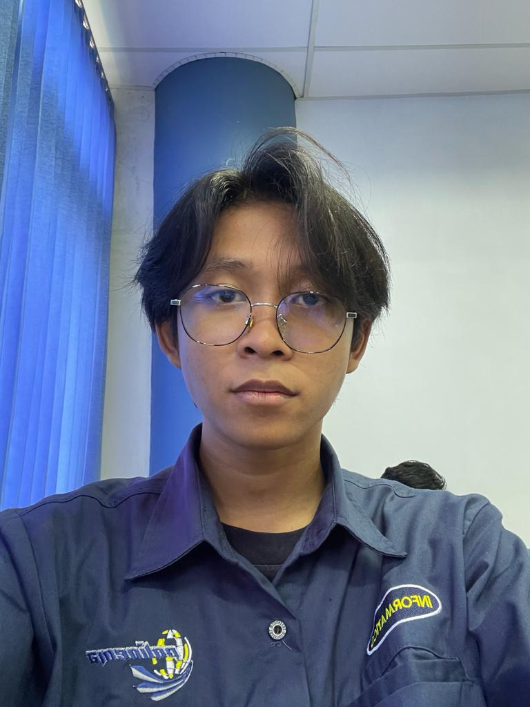

<h1 align="center">Hi there, I'm Muhammad Iqbal Makmur Al-Muniri 👋</h1>

  

---

### ✨ Welcome to My GitHub Profile!

  

---

### About Me

- 🎓 **Student at Politeknik Negeri Malang, Department of Informatics Engineering**
- 🔭 I’m currently working on **Web Development Projects**
- 🌱 I’m currently learning **Machine Learning, Computer Vision, and Mobile Development**
- 👯 I’m looking to collaborate on **Web and Mobile Application Development**
- 💬 Ask me about **Web Development, UI/UX Design, and Project Management**
- 📫 How to reach me: **[iqbalmakmurmuniri@gmail.com](mailto:iqbalmakmurmuniri@gmail.com)**

---

### 🛠️ Tech Stack

- **Languages:**      
- **Frameworks & Tools:**       
- **Other Skills:** UI/UX Design, Database Management (phpMyAdmin), Data Analysis, and Project Management

---

### 📈 GitHub Stats

  
  

---

### 🌐 Let's Connect!

  
  

